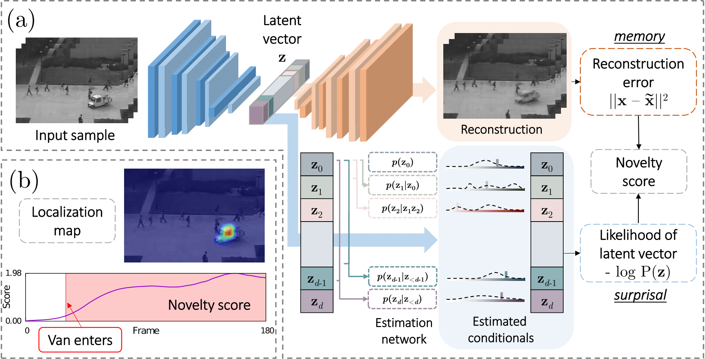

# Latent Space Autoregression for Novelty Detection

This repository contains Pytorch code to replicate experiments in the CVPR19 paper "Latent Space Autoregression for Novelty Detection".

[GIT_REPO](https://github.com/aimagelab/novelty-detection.git)

Please cite with the following BibTeX:
```
@inproceedings{abati2019latent,
  title={{Latent Space Autoregression for Novelty Detection}},
  author={Abati, Davide and Porrello, Angelo and Calderara, Simone and Cucchiara, Rita},
  booktitle={Proceedings of the IEEE/CVF International Conference on Computer Vision and Pattern Recognition},
  year={2019}
}
```



Specifically, performs:
* one class classification on MNIST.
* one class classification on CIFAR-10.
* video anomaly detection on UCSD Ped2.
* video anomaly detection on ShanghaiTech.

### 0 - Clone this repo
First things first, clone this repository locally via git.
```
git clone https://github.com/cvpr19-858/novelty-detection.git
cd novelty-detection
```

### 1 - Environment
This code runs on Python 3.6.
The easiest way to set up the environment is via `pip` and the file `requirements.txt`:
```
pip install -r requirements.txt
```

### 2 - Datasets
MNIST and CIFAR-10 will be downloaded for you by torchvision. 

You still need to download [UCSD Ped](http://www.svcl.ucsd.edu/projects/anomaly/UCSD_Anomaly_Dataset.tar.gz) and 
[ShanghaiTech](https://onedrive.live.com/?authkey=%21AMqh2fTSemfrokE&cid=3705E349C336415F&id=3705E349C336415F%2172436&parId=3705E349C336415F%215109&o=OneUp). After download, please unpack them into the `data` folder as follows

```
tar -xzvf <path-to-UCSD_Anomaly_Dataset.tar.gz> -C data
tar -xzvf <path-to-shanghaitech.tar.gz> -C data
```

### 3 - Model checkpoints
Checkpoints for all trained models are available [here](http://imagelab.ing.unimore.it/files/lsa-novelty-detection/checkpoints.tar.gz).

Please untar them into the `checkpoints` folder as follows:
```
tar -xzvf <path-to-tar.gz> -C checkpoints
```

### 4 - Run!
Once your setup is complete, running tests is as simple as running `test.py`.

Usage:

```
usage: test.py [-h]

positional arguments:
              The name of the dataset to perform tests on.Choose among
              `mnist`, `cifar10`, `ucsd-ped2`, `shanghaitech`

optional arguments:
  -h, --help  show this help message and exit
```

Example:
```
python test.py ucsd-ped2
```
